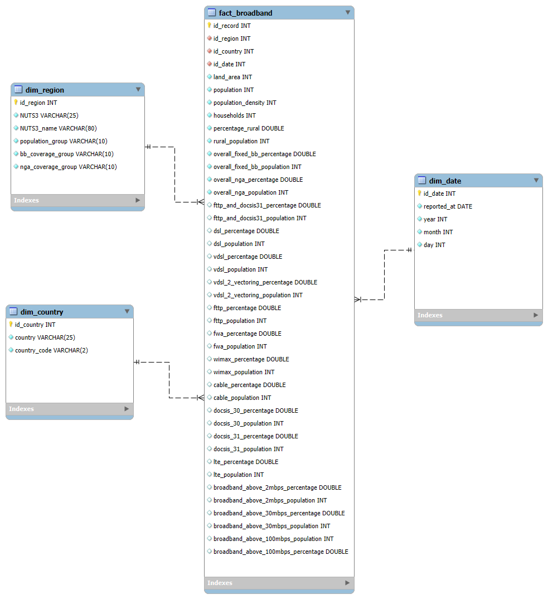
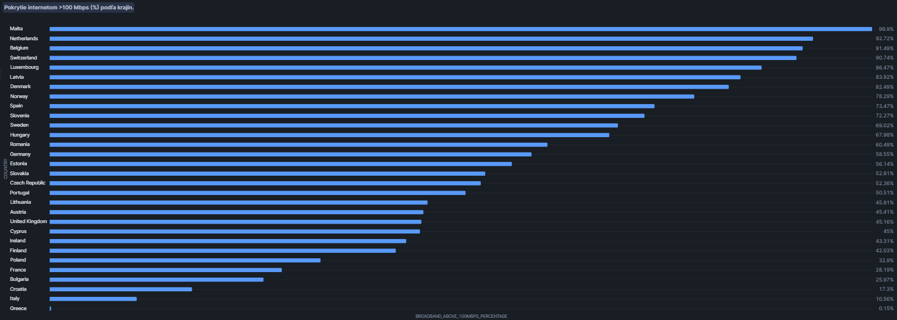
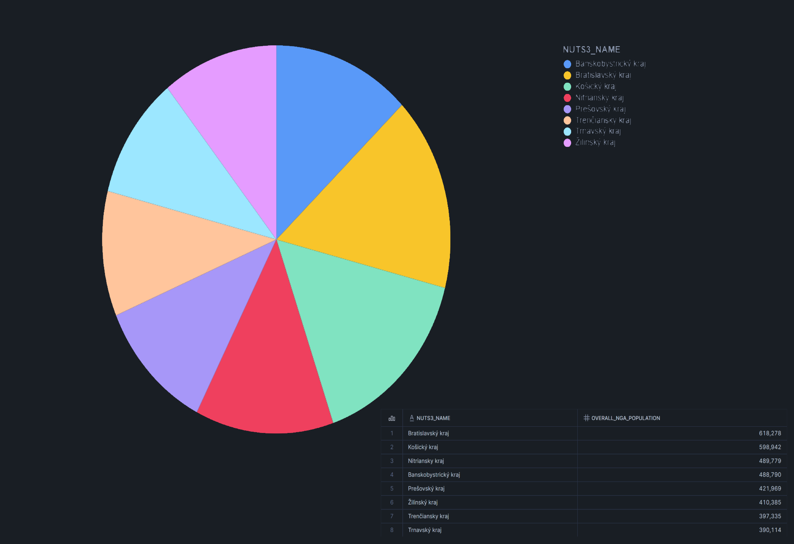
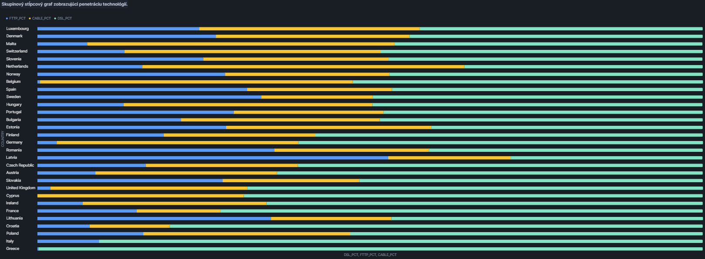
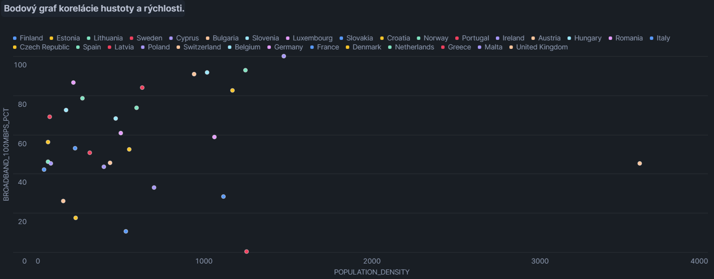
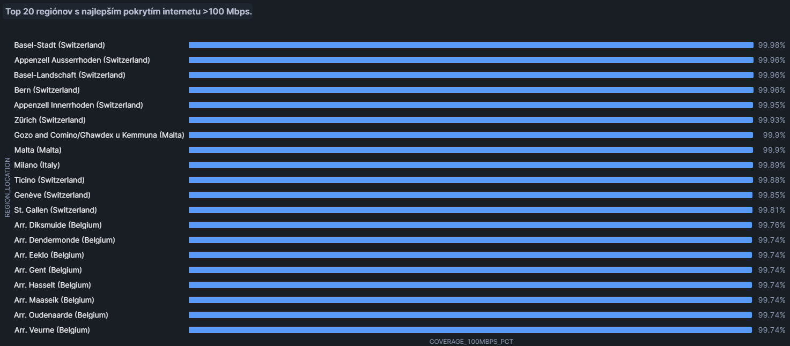
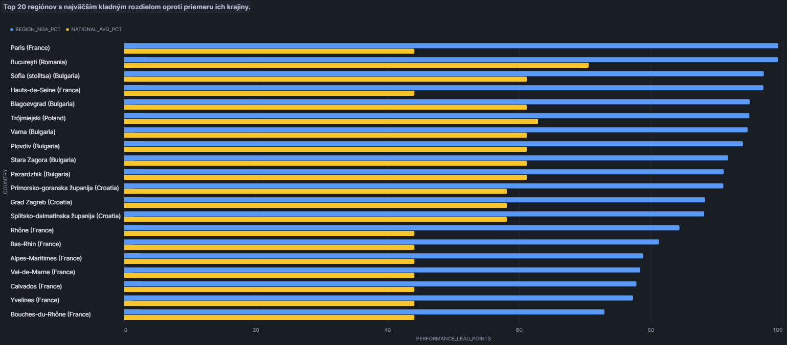

# European-Broadband-Markets-ELT
Implementácia ELT procesu v Snowflake a vytvorenie dátového skladu so schémou Star na datasete [European-Broadband-Markets-2017](https://app.snowflake.com/marketplace/listing/GZSVZ6EW2A/expert-intelligence-european-broadband-markets-2017?search=europe&pricing=free&available=available). Dataset má údaje z 1405 regiónov z 30 štátov. Zameraním projektu je preskúmať pokrytie jednotlivých technológií prenosu dát v  Európskych krajinách a ich regiónoch v roku 2017.

<hr>

## 1. Úvod a popis zdrojových dát
Analyzujeme dáta o technológiach prenosu dát, ich pokrytí v jednotlivých štátoch a ich regiónov. Cieľ je:
- Identifikovať krajiny s najváčším pokrytím vysokorýchlostného internetu
- Zistiť podiel káblových technológií využívaných v rozných krajinách
- Zobraziť podiel slovenských krajov na totálne pokrytie NGA na Slovensku
- Zoradiť rôzne regióny v Európe podľa rôznych kritérií
- Zobraziť vzťah medzi hustotou obyvateľstva a pokrytím vysokorýchlostného internetu

Dataset obsahuje jednu tabulku `EUROPEAN_BROADBAND_MARKETS_2017_FREE_DATASET`, ktorá obsahuje údáje o počte obyvateľov, domácností podľa regiónov a štátov a štatistiky o využívaní jednotlivých technológií (DSL, VDSL, FTTP...). 

Účelom ELT procesu je tieto dáta pripraviť, transformovať a sprístupniť na viacdimenzionálnu analýzu.

<hr>

### 1.1 ERD diagram zdrojového datasetu
Relačný model dát z tohoto datasetu je znázornený v entitno-relačnom diagrame:
<p align="center">
  
  <br>
  <em>Obrázok 1 - Entitno-relačná schéma</em>
</p>

<hr>

## 2. Dimenzionálny model
Návrh schémy hviezdy podľa Kimballovej metodológie, obsahuje 1 tabuľku faktov `fact_broadband`, ktorá je prepojená s nasledujúcimi 3 dimenziami:
- `dim_region` ukladá názov regiónu, jeho skratku a kategórie do ktorých spadá. SCD typ 1. Vzťah k tabuľke faktov je 1:N
- `dim_country` ukladá krajinu a jej skratku. SCD typ 1. Vzťah k tabuľke faktov je 1:N
- `dim_date` obsahuje dátum merania štatistík. SCD typ 0. Vzťah k tabuľke faktov je 1:N

Tabulka faktov `fact_broadband` obsahuje PK `id_record`, FK `id_region, id_country, id_date` a ďalej údaje o ploche kraja, počte obyvateľov, hustoty obyvateľstva, počtu domácností a ďalšie údaje zamerané na počet obyvateľstva využívajúceho danú technológiu a jej percentuálna časť s celkového obyvateľstva. 

Schéma hviezdy je znázornená na diagrame pre vizualizáciu prepojenia medzi tabulkami dimenzií a tabulky faktov:
<p align="center">
  
  <br>
  <em>Obrázok 2 - Star schéma pre European-Broadband-Markets-2017</em>
</p>

<hr>

## 3. ELT proces v Snowflake
**ELT** je proces rozdelený na tri časti: **Extract, Load, Transform**.  
Tento proces nám v Snowflake-u pomôže zdrojové údaje pripraviť zo staging vrstvy do dimenzionálneho modelu, ktorý je vhodný na analýzu a vizualizáciu.

<hr>

### 3.1 Extract
Zdrojový dataset sme si stiahli do spoločného priestoru, vďaka tomu sme dáta priamo nahrali do staging tabuľky a nepotrebovali sme manuálne sťahovať žiadne súbory. Staging tabuľka slúži na dočasné uloženie importovaných dát. 

**Zdrojová databáza:** [European-Broadband-Markets-2017](https://app.snowflake.com/marketplace/listing/GZSVZ6EW2A/expert-intelligence-european-broadband-markets-2017?search=europe&pricing=free&available=available)  
**Schéma:** EBM  
**SQL kód:**
```sql
CREATE OR REPLACE TABLE staging AS
SELECT * FROM EUROPEAN_BROADBAND_MARKETS_2017_GATOR_EAGLE.EBM.EUROPEAN_BROADBAND_MARKETS_2017_FREE_DATASET;

// Test
select * from staging;
```

<hr>

### 3.2 Load
Následne sme načítavali dáta do jednotlivých tabuliek podľa navrhnutého dimenzionálneho modelu. Na to sme použili pri vytváraní dimenzie príkaz `AS SELECT`, ktorý nam umožnil kopírovať dáta priamo z `staging` tabuľky. Každej tabulke sme pomocou `ROW_NUMBER()` funkcie vytvorili primárne klúče. Po načítaní údajov do tabuliek sme overili správnosť načítania. Príklad je z tabuľky faktov:

**SQL kód:**
```sql
CREATE OR REPLACE TABLE fact_broadband AS
SELECT
    ROW_NUMBER() OVER (ORDER BY s.nuts3) AS id_record,
    c.id_country,
    r.id_region,
    d.id_date,
    s.land_area,
    s.population,
    s.population_density,
    s.households,
    s.percentage_rural,
    s.rural_population,
    s.overall_fixed_bb_percentage,
    s.overall_fixed_bb_population,
    s.overall_nga_percentage,
    s.overall_nga_population,
    s.fttp_and_docsis31_percentage,
    s.fttp_and_docsis31_population,
    s.dsl_percentage,
    s.dsl_population,
    s.vdsl_percentage,
    s.vdsl_population,
    s.vdsl_2_vectoring_percentage,
    s.vdsl_2_vectoring_population,
    s.fttp_percentage,
    s.fttp_population,
    s.fwa_percentage,
    s.fwa_population,
    s.wimax_percentage,
    s.wimax_population,
    s.cable_percentage,
    s.cable_population,
    s.docsis_30_percentage,
    s.docsis_30_population,
    s.docsis_31_percentage,
    s.docsis_31_population,
    s.lte_percentage,
    s.lte_population,
    s.broadband_above_2mbps_percentage,
    s.broadband_above_2mbps_population,
    s.broadband_above_30mbps_percentage,
    s.broadband_above_30mbps_population,
    s.broadband_above_100mbps_percentage,
    s.broadband_above_100mbps_population
FROM staging s
JOIN dim_country c ON s.country_code = c.country_code
JOIN dim_region r ON s.nuts3 = r.nuts3
JOIN dim_date d ON s.reported_at = d.reported_at;

// Overenie
SELECT * FROM fact_broadband ORDER BY id_record;
```

<hr>

### 3.3 Transform
Pri transformovaní dát bolo potrebné využiť SQL funkcie na čistenie, úpravu a obohatenie pôvodných dát:
- Deduplikovať názvy krajín pomocou `SELECT DISTINCT`
- Vytvoriť primárne klúče cez window function `ROW_NUMBER()`
- Rozdeliť dátum cez funkcie `YEAR()`, `MONTH()`, `DAY()`
- Pridať kategórie cez `CASE`

Cieľom bolo získať dimenzie a faktovú tabuľku, ktoré umožnia jednoduchú analýzu.

Dimenzie sme navrhli tak aby poskytovali dáta pre tabuľku faktov. `dim_region` má údaje o názve regiónu, skratke daného regiónu a kategórie do ktorých spadá podľa počtu obyvateľov (napr. *"500K-1M"*), percenta obyvateľov s širokopásmovým (broadband) pripojením a percenta obyvateľov s Next Generation Access (NGA) prístupom (napr. *"60-79%"*). Táto dimenzia je typu `SCD 1`, teda neuchováva históriu názvov ani kategórií.

**SQL kód:**
```sql
CREATE OR REPLACE TABLE dim_region AS
SELECT 
    ROW_NUMBER() OVER (ORDER BY nuts3) AS id_region,
    nuts3,
    nuts3_name,
    CASE
        WHEN population < 50000 THEN 'Under 50K'
        WHEN population BETWEEN 50000 AND 100000 THEN '50K-100K'
        WHEN population BETWEEN 100000 AND 500000 THEN '100K-500K'
        WHEN population BETWEEN 500000 AND 1000000 THEN '500K-1M'
        WHEN population BETWEEN 1000000 AND 5000000 THEN '1M-5M'
        WHEN population BETWEEN 5000000 AND 10000000 THEN '5M-10M'
        WHEN population BETWEEN 10000000 AND 50000000 THEN '10M-50M'
        WHEN population > 50000000 THEN '50M+'
        ELSE 'Unknown'
    END AS population_group, // Zaradenie do skupiny podla počtu obyvateĽov
    CASE
        WHEN ROUND(overall_fixed_bb_percentage, 2) < 0.20 THEN 'Under 20%'
        WHEN ROUND(overall_fixed_bb_percentage, 2) BETWEEN 0.20 AND 0.39 THEN '20%-39%'
        WHEN ROUND(overall_fixed_bb_percentage, 2) BETWEEN 0.40 AND 0.59 THEN '40%-59%'
        WHEN ROUND(overall_fixed_bb_percentage, 2) BETWEEN 0.60 AND 0.79 THEN '60%-79%'
        WHEN ROUND(overall_fixed_bb_percentage, 2) BETWEEN 0.80 AND 0.89 THEN '80%-89%'
        WHEN ROUND(overall_fixed_bb_percentage, 2) BETWEEN 0.90 AND 0.99 THEN '90%-99%'
        WHEN ROUND(overall_fixed_bb_percentage, 2) > 0.99 THEN '100%'
        ELSE 'Unknown'
    END AS bb_coverage_group, // Zaradenie do skupiny podla % broadband pripojenia
    CASE
        WHEN ROUND(overall_nga_percentage, 2) < 0.20 THEN 'Under 20%'
        WHEN ROUND(overall_nga_percentage, 2) BETWEEN 0.20 AND 0.39 THEN '20%-39%'
        WHEN ROUND(overall_nga_percentage, 2) BETWEEN 0.40 AND 0.59 THEN '40%-59%'
        WHEN ROUND(overall_nga_percentage, 2) BETWEEN 0.60 AND 0.79 THEN '60%-79%'
        WHEN ROUND(overall_nga_percentage, 2) BETWEEN 0.80 AND 0.89 THEN '80%-89%'
        WHEN ROUND(overall_nga_percentage, 2) BETWEEN 0.90 AND 0.99 THEN '90%-99%'
        WHEN ROUND(overall_nga_percentage, 2) > 0.99 THEN '100%'
        ELSE 'Unknown'
    END AS nga_coverage_group, // Zaradenie do skupiny podla % nga pripojenia
FROM staging;

// Overenie
SELECT * FROM dim_country;
```
Dimenzia `dim_date` uchováva údaje o dátumoch, v ktorých sa uskutočnil zber štatistík. Má ďalej rozdelené údaje ako deň, mesiac a rok. Táto dimenzia umožňuje porovnávať zmeny v pokrytí postupom rokov alebo v rámci roka. Táto dimenzia má typ `SCD 0` pretože záznamy v tejto dimenzii sú nemenné.

**SQL kód:**
```sql
CREATE OR REPLACE TABLE dim_date AS
SELECT
    ROW_NUMBER() OVER (ORDER BY reported_at) AS id_date,
    reported_at,
    YEAR(reported_at) AS year,
    MONTH(reported_at) AS month,
    DAY(reported_at) AS day
FROM (SELECT DISTINCT reported_at FROM staging);

// Overenie
SELECT * FROM dim_date;
```

Posledná dimenzia `dim_country` obsahuje názov a kód krajiny. Tiež je typu `SCD 1` ako `dim_region`, pretože nepotrebujeme uchovávať históriu názvov krajín alebo ich kódov.  

**SQL kód:**
```sql
CREATE OR REPLACE TABLE dim_country AS
SELECT
    ROW_NUMBER() OVER (ORDER BY country_code) AS id_country,
    country,
    country_code
FROM (SELECT DISTINCT country, country_code FROM staging);

SELECT DISTINCT country, country_code FROM staging; // Vytiahnutie len jedinečných krajín

// Overenie
SELECT * FROM dim_country;
```

Po dokončení ELT procesu môžeme uvoľniť priestor odstránením zdrojových dát zo staging tabuľky pomocou príkazu:

**SQL kód:**
```sql
// Vymazanie staging tabuľky
DROP TABLE IF EXISTS staging;
```

<hr>

## 4. Vizualizácia dát
V tejto časti prezentujeme 6 vizualizácií, ktoré zobrazujú rôzne faktické údaje a porovnania.
<hr>

### 4.1 Pokrytie internetom >100 Mbps (%) podľa krajín.
**Účel:** Porovnať pripravenosť európskych krajín na ultra-vysoké rýchlosti a určiť trhových lídrov.

**SQL kód:**
```sql
USE DATABASE BROADBAND_MARKETS;
USE SCHEMA BROADBAND_MARKETS.PUBLIC;

SELECT 
    d.country,
    TO_VARCHAR(ROUND(AVG(f.broadband_above_100mbps_percentage) * 100, 2)) || '%' AS avg_percentage
FROM dim_country AS d
JOIN fact_broadband AS f
    ON d.id_country = f.id_country
GROUP BY d.country
ORDER BY AVG(f.broadband_above_100mbps_percentage) DESC;
```

**Vizualizácia:**
<p align="center">
  
  <br>
  <em>Obrázok 3 - Vizualizácia 1</em>
</p>

**Výsledok:** Existuje obrovská digitálna priepasť medzi lídrami (Malta, Holandsko nad 90 %) a krajinami na chvoste (Grécko pod 1 %), čo naznačuje nerovnomerný stav modernizácie sietí v EÚ.
<hr>

### 4.2 Pokrytie NGA v slovenských krajoch.
**Účel:** Vizualizovať distribúciu obyvateľstva s prístupom k moderným sieťam (NGA) v rámci Slovenskej republiky.

**SQL kód:**
```sql
USE DATABASE BROADBAND_MARKETS;
USE SCHEMA BROADBAND_MARKETS.PUBLIC;

SELECT 
    r.NUTS3_NAME, 
    f.OVERALL_NGA_POPULATION
FROM PUBLIC.DIM_REGION r
JOIN PUBLIC.FACT_BROADBAND f ON r.ID_REGION = f.ID_REGION
WHERE r.NUTS3_NAME != 'Slovakia'
  AND r.NUTS3 LIKE 'SK0%'
ORDER BY f.OVERALL_NGA_POPULATION DESC;
```

**Vizualizácia:**
<p align="center">
  
  <br>
  <em>Obrázok 4 - Vizualizácia 2</em>
</p>

**Výsledok:** Pokrytie je relatívne rovnomerne rozdelené medzi kraje, avšak Bratislavský a Košický kraj vedú, čo odzrkadľuje koncentráciu infraštruktúry v okolí dvoch najväčších miest.
<hr>

### 4.3 Zobrazenie penetrácie technológií v Európe.
**Účel:** Analyzovať technologický mix (infraštruktúrny profil) jednotlivých štátov.

**SQL kód:**
```sql
USE DATABASE BROADBAND_MARKETS;
USE SCHEMA BROADBAND_MARKETS.PUBLIC;

SELECT
    d.country,
    ROUND(AVG(f.dsl_percentage) * 100, 2) AS dsl_pct,
    ROUND(AVG(f.fttp_percentage) * 100, 2) AS fttp_pct,
    ROUND(AVG(f.cable_percentage) * 100, 2) AS cable_pct
FROM fact_broadband f
JOIN dim_country d
    ON f.id_country = d.id_country
GROUP BY d.country
ORDER BY fttp_pct DESC;
```

**Vizualizácia:**
<p align="center">
  
  <br>
  <em>Obrázok 5 - Vizualizácia 3</em>
</p>

**Výsledok:** Každý štát má unikátnu stratégiu – kým Lotyšsko alebo Rumunsko dominujú v optike (FTTP), krajiny ako Grécko či Taliansko stále kriticky spoliehajú na staršie metalické DSL vedenia.
<hr>

### 4.4 Bodový graf korelácie hustoty a rýchlosti internetu.
**Účel:** Zistiť, či vysoká hustota obyvateľstva v regióne automaticky zaručuje lepšiu dostupnosť rýchleho internetu.

**SQL kód:**
```sql
USE DATABASE BROADBAND_MARKETS;
USE SCHEMA BROADBAND_MARKETS.PUBLIC;

SELECT
    d.country,
    AVG(f.population_density) AS population_density,
    ROUND(AVG(f.broadband_above_100mbps_percentage) * 100, 2) AS broadband_100mbps_pct
FROM fact_broadband f
JOIN dim_country d
    ON f.id_country = d.id_country
GROUP BY d.country;
```

**Vizualizácia:**
<p align="center">
  
  <br>
  <em>Obrázok 6 - Vizualizácia 4</em>
</p>

**Výsledok:** Bodový graf ukazuje rozptyl, ktorý potvrdzuje, že hustota je faktorom, ale nie pravidlom; existujú hustejšie regióny s nižším pokrytím než redšie osídlené oblasti, čo naznačuje vplyv štátnych investícií.
<hr>

### 4.5 Top 20 regiónov s najlepším pokrytím internetu >100 Mbps.
**Účel:** Identifikovať najlepšie regióny z pohľadu digitálnej infraštruktúry naprieč celou Európou.

**SQL kód:**
```sql
USE DATABASE BROADBAND_MARKETS;
USE SCHEMA BROADBAND_MARKETS.PUBLIC;

SELECT 
    r.nuts3_name || ' (' || c.country || ')' AS region_location,
    TO_VARCHAR(ROUND(MAX(f.broadband_above_100mbps_percentage) * 100, 2)) || '%' AS coverage_100mbps_pct
FROM fact_broadband f
JOIN dim_region r 
    ON f.id_region = r.id_region
JOIN dim_country c 
    ON f.id_country = c.id_country
WHERE r.nuts3 NOT LIKE '%-TOTAL%'
GROUP BY 1
ORDER BY coverage_100mbps_pct DESC
LIMIT 20;
```

**Vizualizácia:**
<p align="center">
  
  <br>
  <em>Obrázok 7 - Vizualizácia 5</em>
</p>

**Výsledok:** Rebríčku dominujú švajčiarske, belgické a maltské regióny, ktoré dosahujú takmer dokonalé (99,9 %) pokrytie, čím tvoria európsku špičku v konektivite.
<hr>

### 4.6 Top 20 regiónov s najväčším kladným rozdielom oproti priemeru ich krajiny.
**Účel:** Nájsť regióny, ktoré najviac vyčnievajú (pozitívne) nad priemerom svojej vlastnej krajiny.

**SQL kód:**
```sql
USE DATABASE BROADBAND_MARKETS;
USE SCHEMA BROADBAND_MARKETS.PUBLIC;

WITH RegionalBase AS (
    SELECT 
        r.nuts3_name || ' (' || c.country || ')' AS region_label,
        c.country,
        f.overall_nga_percentage * 100 AS nga_pct
    FROM fact_broadband f
    JOIN dim_region r 
        ON f.id_region = r.id_region
    JOIN dim_country c 
        ON f.id_country = c.id_country
    WHERE r.nuts3_name NOT LIKE '%-TOTAL%' 
)
SELECT 
    region_label,
    ROUND(nga_pct, 2) AS region_nga_pct,
    ROUND(AVG(nga_pct) OVER(PARTITION BY country), 2) AS national_avg_pct,
    ROUND(nga_pct - AVG(nga_pct) OVER(PARTITION BY country), 2) AS deviation_pct
FROM RegionalBase
ORDER BY deviation_pct DESC
LIMIT 20;
```

**Vizualizácia:**
<p align="center">
  
  <br>
  <em>Obrázok 8 - Vizualizácia 6</em>
</p>

**Výsledok:** Najväčší náskok majú metropoly ako Paríž, Bukurešť a Sofia, čo potvrdzuje, že hlavné mestá sú hlavnými motormi digitalizácie a často fungujú ako „izolované ostrovy“ vysokej rýchlosti vo svojej krajine.
<hr>

**Autori:** [Matúš Gabaš](https://github.com/snickers-c) a [Juraj Daniš](https://github.com/Jur1n0)
